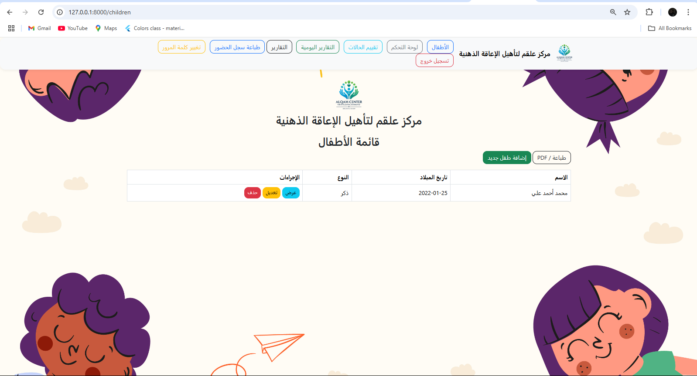
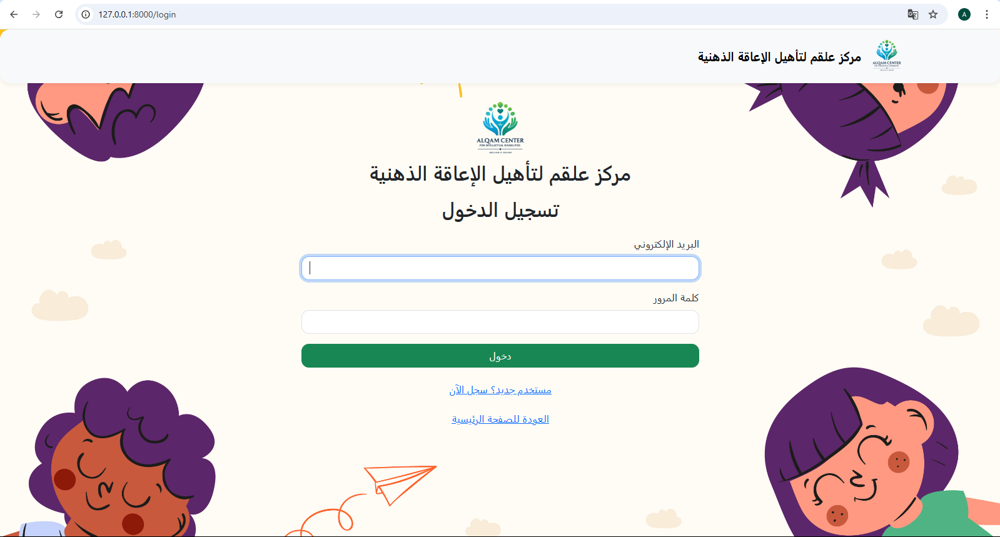

#تم اضافة ميزة ادارة الخطابات الرسمية


# نظام دعم الأطفال

## وصف المشروع
نظام متكامل لإدارة دعم الأطفال، يتيح تتبع الإيرادات والمصروفات وإدارة الحسابات والتقارير المالية.

## المميزات الرئيسية
- إدارة بيانات الأطفال
- تتبع الإيرادات والمصروفات
- إدارة الحسابات البنكية والنقدية
- إنشاء التقارير المالية
- إدارة الميزانيات
- تقييم الحالات
- التقارير اليومية
- إدارة المستخدمين والصلاحيات
## هيكل النظام
### الوحدات الرئيسية
1. إدارة الأطفال
   
   - تسجيل بيانات الأطفال
   - متابعة حالات الأطفال
   - تقييم الحالات

2. الإدارة المالية
   
   - تسجيل الإيرادات
   - تسجيل المصروفات
   - إدارة الحسابات
   - إدارة الميزانيات
   - التقارير المالية

3. إدارة المستخدمين
   
   - إدارة الصلاحيات
   - تسجيل الدخول
   
4. التقارير
   
   - التقارير اليومية
   - تقارير الحالات
   - التقارير المالية

## الشاشات

1. شاشات الحسابات
   - لوحة التحكم الرئيسية للحسابات
     
   - التصنيفات
     
   - الإقفالات
     
   - المصروفات
     
   - الديون
     
   - التقارير
     
   - التصفية والاستعلامات
     

2. شاشات الحضور
   - إدخال الحضور
     
   - عرض الحضور
     

3. شاشات الأطفال
   - قائمة الأطفال
     
   - إنشاء طفل جديد
     
   - تقارير الأطفال
     
   - تقييم الحالة
     
   - إنشاء تقييم حالة
     

4. شاشات التقارير
   - التقارير اليومية
     
   - إنشاء تقرير يومي
     
   - إنشاء تقرير
     

5. شاشات النظام
   - لوحة التحكم الرئيسية
     
   - تسجيل الدخول
     
   - تغيير كلمة المرور
     
 
## المتطلبات التشغيلية

### متطلبات النظام
- PHP 8.1 أو أحدث
- Laravel 10.x
- نظام إدارة قواعد البيانات SQLite
- Composer
- Node.js و NPM

### متطلبات التشغيل
1. تثبيت PHP والإضافات المطلوبة
2. تثبيت Composer
3. تثبيت Node.js و NPM
4. نسخ ملف .env.example إلى .env وتعديل إعدادات قاعدة البيانات
5. تشغيل الأوامر التالية:
```bash
composer install
npm install
php artisan key:generate
php artisan migrate
php artisan db:seed
```
